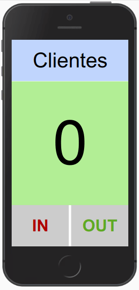
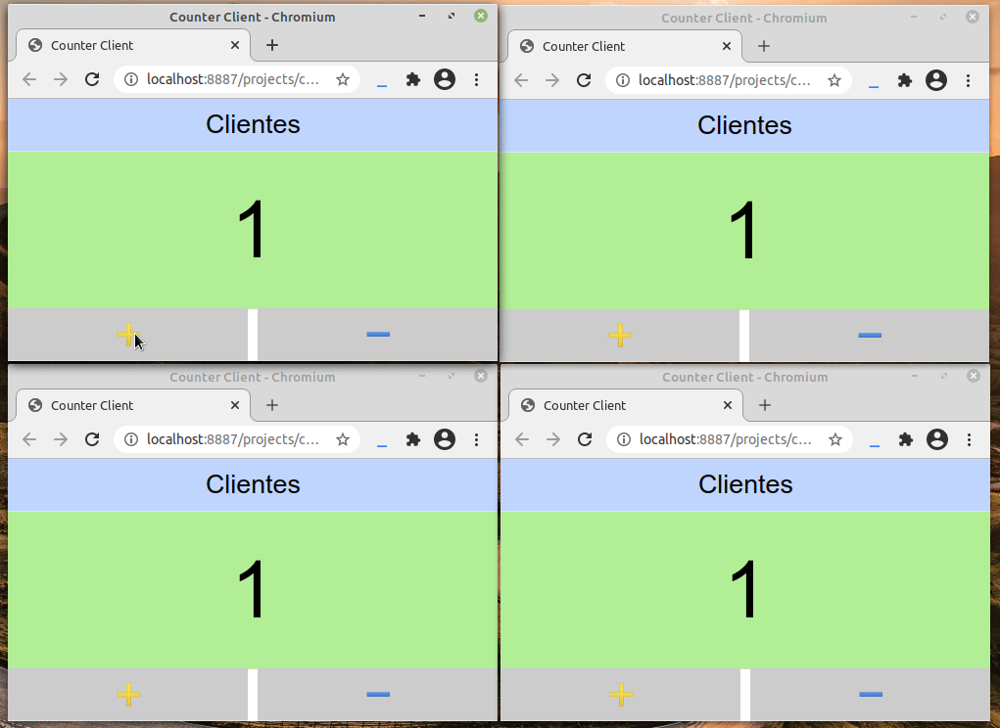

## Os três lados de uma moeda.

Ah, mas uma moeda só tem dois lados! Ok, mas vamos começar com o lado de dentro. Mas atenção:

* Não tente aprender [Beads](http://beadslang.org/home) Beads por aqui. Utilize a documentação.
* Não tente aprender técnicas de programação lendo este texto. Faça um bom curso!
* Não pense que se você entendeu o programa, programar é tão fácil.
* A situação é ficção mas vai que...

A única verdade é que, o que foi feito aqui e muito mais, pode ser feito utilizando Beads. Mas vamos aos lados da moeda.

### 1.Lado um

O problema é muito simples. Com a covid, o governo limitou o números de pessoas nos estabelecimentos a 10%. Como nosso estabelecimento possui capacidade para 100 pessoas, podemos deixar entrar apenas 10. Então queremos um contador que informe o número de pessoas que estão no estabelecimento. Incrementamos quando alguém entra e decrementamos quando alguém sai. Tem um computador na porta e vamos fazer um programinha para a tarefa. A tela fica verde se mais pessoas podem entrar, ou vermelha se atingiu a capacidade máxima. Podemos escolher qualquer linguagem mas, aqui, usaremos Beads. 

Um programa para atender os requisitos poderia ser: 

```
beads 1 program 'Counter'

// ------------------
// procedure division
record a_counter
    value : num
    color : color

var counter : a_counter

const
    MAXIMUM = 10
    COLOR_OK   = LIGHT_GREEN
    COLOR_FULL = RED

// --------------------
calc main_init
    counter.value = 0
    counter.color = COLOR_OK

// --------------------
calc inc_counter
    counter.value = min(counter.value+1, MAXIMUM)
    counter.color = COLOR_FULL if counter.value == MAXIMUM else COLOR_OK

// --------------------
calc dec_counter
    counter.value = max(counter.value-1, 0)
    counter.color = COLOR_OK
```

Ok, já temos a parte principal pronta. Inicializa as variáveis, incrementa ajustando a cor e não deixando passar do número máximo e decrementa ajustando a cor não deixando passar do número mínimo (zero significa que está vazio) Com os comentários e as linhas em branco e não chegou a 30 linhas de código. 

Bem, agora temos que fazer a interface com o usuário. Também utilizando Beads, é claro. Um bom candidato seria o código abaixo. 

```
// ------------------
// screen section
const
    TITLE = 'Clientes'

// --------------------
draw my_button (
    prompt : str
    action : calc (frozen)
    color : color
    )
    draw_rect(fill:GRAY2, pos:0)
    draw_str(prompt, color:color, size:0.4, bold:Y)
track EV_TAP
    action()
    return Y

// --------------------
horz slice d_buttons
    add 50 al
        my_button('IN',inc_counter,#CC0000)
    skip 2 al
    add 50 al
        my_button('OUT',dec_counter,#00AA00)

// --------------------
draw d_title
    draw_rect(fill:#B7D5FE)
    draw_str(TITLE,size:0.5)

// --------------------
vert slice d_gui
    add 20 al d_title
    add 60 al
        draw_rect(fill:counter.color)
        draw_str(counter.value,size:0.5)
    add 20 al d_buttons

// --------------------
draw main_draw
    d_gui
```

Bem, com comentários, linhas em branco e uma rotina para simular os botões (lembrando que Beads ainda está em desenvolvimento) são 41 linhas de código. 

O resultado final ficou assim. Opps. O computador que estava na entrada estragou. Não tem problema, pegamos o celular do funcionário. :D

 

## 2.Lado dois

As regras continuam as mesmas mas o governo exige que os estabelecimentos tenham dois locais para entrada e saída, distantes um do outro. Evita aglomerações. Bem, o antigo programa já não será indicado para o serviço pois os dois clientes deveriam trabalhar apenas com um acumulador. A saída poderia ser uma arquitetura cliente/servidor. Primeiro iremos tratar do lado dois, isto é, do servidor.  Será que é muito difícil converter a primeira parte do programa para rodar no servidor? Na realidade é bastante simples. Temos que seguir os seguintes passos:

#### trocar o cabeçalho do programa

De `beads 1 program 'Counter'` para `beads 1 server 'Counter Server'`para informar que rodará no servidor como um módulo `node`.

#### Incluir um identificador

Os clientes irão compartilhar o identificador. Se algum programa tentar se conectar com o servidor sem o identificador será apenas ignorado (não será enviada nenuma mensagem de erro). No nosso caso vamos criar assim:

```
enum
    COUNTER_ID*
```

#### especificar a porta para conexão

Basta escolher uma porta disponível. Para escolher a porta 4444 escrevemos:

```
const
    SERVER_PORT* = 4444
```

#### especificar o que iremos compartilhar

Para quem trabalha com OO, seria parecido com métodos variáveis públicas. O que não for exportado não poderá ser visto pelo cliente.  Veja que `COUNTER_ID*` e `SERVER_PORT*` estão sendo exportados, isto é, o cliente terá acesso à porta (se os dois não usarem a mesma porta não poderão se comunicar, né?). Outras informações que deveremos exportar é o `record a_counter*`para o cliente saber como é a estrutura do nosso registro e as funções `inc_counter*` e `dec_counter*`. O cliente não terá como acessar `main_init` pois não foi exportada. As funções `inc_counter` e `dec_counter` poderia ser agrupadas em uma função chmada `delta_counter(value)` e ser chamada com 1 ou -1 para incrementar ou decrementar. 

#### disponibilizar o servidor

Para iniciar o servidor, colocamos na função `main_init` a seguinte linha:

```
publish_start(SERVER_PORT, COUNTER_ID, 1000, counter, inc_counter, dec_counter)    
```

* SERVER_PORT é a porta (4444)
* COUNTER_ID é o número mágico para a conexão
* 1000 é a largura de banda máxima (Kb/s)
* counter são os dados que o servidor irá receber (apenas leitura)
* inc_counter, dec_counter é a lista de funções que o cliente poderá chamar remotamente.

#### resultado final

Trocamos o cabeçalho do programa, incluímos 4 linhas (poderia ser apenas duas pois poderiíamos escrever na mesma linha) os valores de `enum` e `const`),  incluímos a linha para iniciar o servidor e definimos o que poderia ser compartilhado com os clientes. O resultado é:

```
beads 1 server 'Counter Server'

enum COUNTER_ID*

const SERVER_PORT* = 4444


// ------------------
// procedure division
record a_counter*
    value : num
    color : color

var counter : a_counter

const
    MAXIMUM = 10
    COLOR_OK   = LIGHT_GREEN
    COLOR_FULL = RED

// --------------------
calc main_init
    counter.value = 0
    counter.color = COLOR_OK
    publish_start(SERVER_PORT, COUNTER_ID, 1000, counter, inc_counter, dec_counter)

// --------------------
calc inc_counter*
    counter.value = min(counter.value+1, MAXIMUM)
    counter.color = COLOR_FULL if counter.value == MAXIMUM else COLOR_OK

// --------------------
calc dec_counter*
    counter.value = max(counter.value-1, 0)
    counter.color = COLOR_OK
```

Praticamente o mesmo programa inicial. Foi de 29 para 35 linhas.

## 3.Lado três

Agora precisamos do cliente. Também será igual ao original acrescentando a cominucação com o servidor.

#### principais alterações no programa inicialinicio do servidor

```
beads 1 program 'Counter Client'

from remote counter_server import SERVER_PORT, COUNTER_ID, a_counter, inc_counter, dec_counter

const
    HOST = "ws://localhost"

var
    con1 : a_client_conn
    counter : a_counter

calc main_init
    subscribe_start(con1, HOST, SERVER_PORT, COUNTER_ID, U, counter)
```

O cabeçalho poderia ficar o mesmo mas eu troquei o nome para `Counter Client`. Depois temos a linha `from` que indicará o que o cliente está compartilhando com o servidor. Informamos onde está o servidor e criamos duas variáveis. Uma para o estado da conexão, `con1` e outra para armazenar localmente os dados enviados pelo servidor `counter`.  Também precisamos da `calc main_init` para iniciar a conexão com o servidor.

* con1 irá armazenar o estado da conexão
* HOST é a URL do servidor
* SERVER_PORT é a porta para a comunicação com o servidor
* COUNTER_ID e'o número mágico para poder conectar
* U é o número de atualizações por segundo (se for um número) ou U (indefinido) para o servidor atualizar quando necessário
* counter é a variável onde o servidor irá armazenar os dados enviados

A parte dos botões (feitas em casa) precisou de algumas alterações. Não foi possível enviar o endereço das funções do servido como parâmetro para os botões. Não sei se será no futuro. Então, tive que criar as funções `my_inc` e `my_dec` para as chamadas ao servidor. Ficou assim:

```
calc my_inc
    inc_counter via con1

calc my_dec
    dec_counter via con1

// --------------------
draw my_button (
    prompt : str
    action : calc (frozen)
    color : color
    )
    draw_rect(fill:GRAY2, pos:0)
    draw_str(prompt, color:color, size:0.4, bold:Y)
track EV_TAP
    action()
    return Y

// --------------------
horz slice d_buttons
    add 50 al
        my_button('➕',my_inc,#CC0000)
    skip 2 al
    add 50 al
        my_button('➖',my_dec,#00AA00)
```

Como são apenas duas funções não tem muito problema. Mas se fossem várias, poderia ser mais interessante criar uma função para gerenciar as tarefas.

Finalmente, `main_draw` ficou assim:

```
// --------------------
draw main_draw
    case con1.client_status
    | CSTATUS_CONNECTING
        draw_rect(fill:MEDIUM_PURPLE)
        draw_str("😴 Connecting to server...", size:50 pt, color:WHITE)
    | CSTATUS_CONNECTED
        d_gui
    else
        draw_rect(fill:MEDIUM_PURPLE)
        draw_str("😲 Server not responding", size:50 pt, color:WHITE)
```

Mas para dar um retorno ao usuário. Se estiver conectado, o programa roda normalmente. Caso esteja conectando ou o servidor caia, é importante que o usuário saiba. E se o programa estiver rodando e o servidor cair? Leia a documentação da linguagem. Beads é suficientemente inteligente para saber qualdo algo for alterado e tiver que ser mostrado novamente. Como uma planilha onde tem uma fórmula tipo `A1 = C5 + D18`. Se o valor de C5 ou D18 for alterado, o valor de A1 deve ser recalculado. 

O programa completo ficou assim:

```
beads 1 program 'Counter Client'

from remote counter_server import SERVER_PORT, COUNTER_ID, a_counter, inc_counter, dec_counter

const
    HOST = "ws://localhost"

var
    con1 : a_client_conn
    counter : a_counter

calc main_init
    subscribe_start(con1, HOST, SERVER_PORT, COUNTER_ID, U, counter)

// -----------
// CLIENT SIDE
// -----------

const
    TITLE = 'Counter'

calc my_inc
    inc_counter via con1

calc my_dec
    dec_counter via con1

// --------------------
draw my_button (
    prompt : str
    action : calc (frozen)
    color : color
    )
    draw_rect(fill:GRAY2, pos:0)
    draw_str(prompt, color:color, size:0.4, bold:Y)
track EV_TAP
    action()
    return Y

// --------------------
horz slice d_buttons
    add 50 al
        my_button('➕',my_inc,#CC0000)
    skip 2 al
    add 50 al
        my_button('➖',my_dec,#00AA00)

// --------------------
vert slice d_gui
    add 20 al
        draw_rect(fill:#B7D5FE)
        draw_str(TITLE,size:0.5)
    add 60 al
        draw_rect(fill:counter.color)
        draw_str(counter.value,size:0.5)
    add 20 al d_buttons

// --------------------
draw main_draw
    case con1.client_status
    | CSTATUS_CONNECTING
        draw_rect(fill:MEDIUM_PURPLE)
        draw_str("😴 Connecting to server...", size:50 pt, color:WHITE)
    | CSTATUS_CONNECTED
        d_gui
    else
        draw_rect(fill:MEDIUM_PURPLE)
        draw_str("😲 Server not responding", size:50 pt, color:WHITE)
```

O resultado fica assim (oops. agora a lei exige quatro entradas/saída e temos computador em todas). Agora, com a versão C/S do nosso programa, não temos limitação para o número de entradas e saídas. Mesmo assim, é melhor contratar um engenheiro para o prédio não cair.

 
